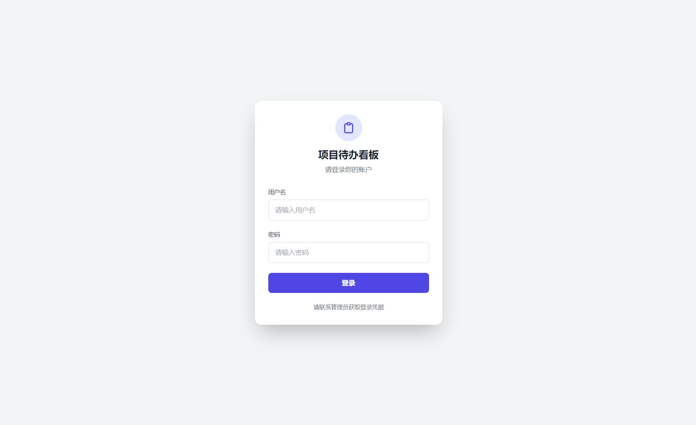
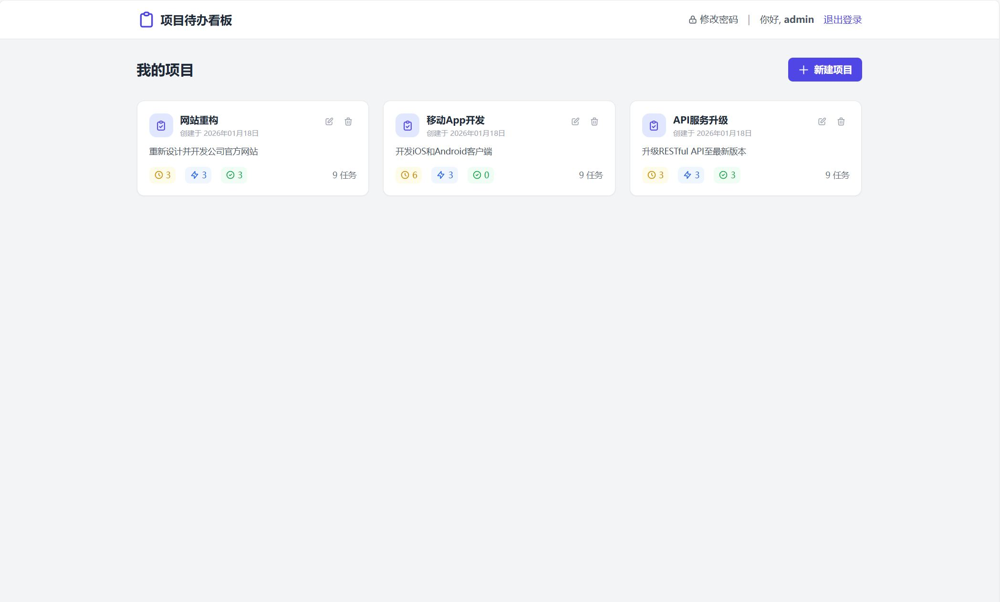
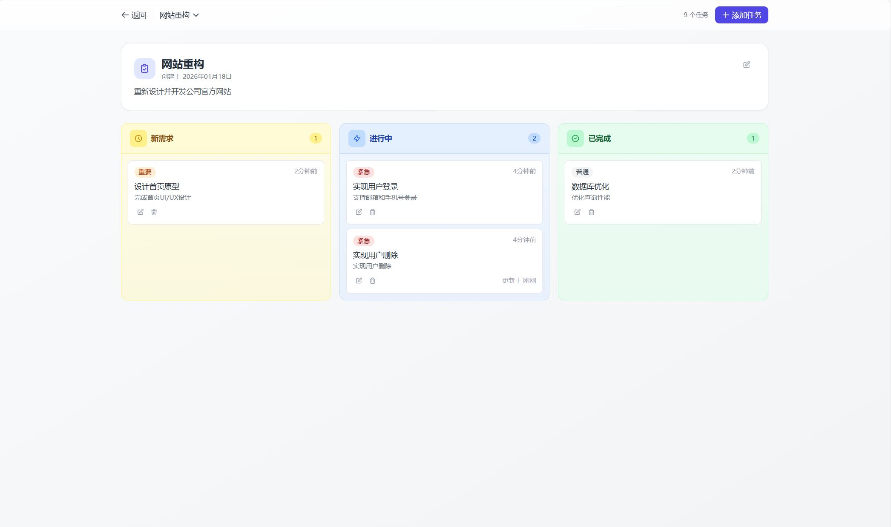

# 看板管家

一个基于 PHP 和 MySQL 开发的轻量级项目管理进度看板，帮助个人高效管理项目任务。

## 功能特性

### 核心功能
- **用户认证系统**：安全的登录登出功能，支持密码修改
- **项目管理**：创建、编辑、删除项目，每个项目相互独立
- **任务管理**：在看板中添加、编辑、删除任务
- **看板视图**：直观的三栏视图（待办、进行中、已完成）
- **拖拽操作**：支持任务在列之间拖拽移动，自动更新状态
- **优先级设置**：普通、重要、紧急三级优先级
- **响应式设计**：完美适配桌面端和移动端设备

### 安全特性
- **CSRF 防护**：全站使用 Token 验证防止跨站请求
- **会话管理**：30 分钟无操作自动退出，HttpOnly Cookie
- **SQL 注入防护**：使用 PDO 预处理语句
- **密码加密**：使用 PHP password_hash() 安全存储
- **输入验证**：严格的参数校验和长度限制

## 技术栈

- **后端**：PHP 7.0+
- **数据库**：MySQL 5.5+
- **前端框架**：Tailwind CSS（通过 CDN 引入）
- **拖拽库**：SortableJS（通过 CDN 引入）
- **数据库驱动**：PDO

## 截图

### 登录页面


### 项目列表



### 项目看板



## 项目结构

```
todo/
├── api/                    # API 接口目录
│   ├── change_password.php # 密码修改接口
│   ├── login.php          # 登录接口
│   ├── logout.php         # 登出接口
│   ├── projects.php       # 项目管理接口
│   └── tasks.php          # 任务管理接口
├── config.php             # 配置文件
├── dashboard.php          # 项目列表页面
├── index.php              # 登录页面
├── kanban.php             # 看板页面
└── schema.sql             # 数据库结构定义
```

## 快速开始

### 环境要求
- PHP 7.0 或更高版本
- MySQL 5.5 或更高版本
- Web 服务器（Apache/Nginx）
- 启用 PDO 和 PDO_MySQL 扩展

### 安装步骤

1. **创建数据库**

   执行以下命令创建数据库和表结构：

   ```bash
   mysql -u root -p < schema.sql
   ```

   或者在 MySQL 客户端中运行 `schema.sql` 文件内容。

2. **配置数据库连接**

   编辑 `config.php` 文件，修改以下配置项：

   ```php
   $host = 'localhost';      # 数据库主机
   $dbname = 'kanban_db';    # 数据库名称
   $username = 'root';       # 数据库用户名
   $password = 'root';       # 数据库密码
   ```

3. **启动 Web 服务器**

   - 使用 PHP 内置服务器：

     ```bash
     php -S localhost:8000
     ```

   - 或配置 Apache/Nginx 虚拟主机，指向项目目录

4. **访问应用**

   打开浏览器访问 `http://localhost:8000`

5. **登录凭据**

   系统预置了默认管理员账户：
   - 用户名：`admin`
   - 密码：`admin123`

   首次登录后建议立即修改密码。

## 使用指南

### 登录系统
1. 在登录页面输入用户名和密码
2. 点击「登录」按钮
3. 验证通过后自动跳转到项目列表页面

### 管理项目
1. 在项目列表页面，点击「新建项目」按钮
2. 填写项目名称和描述
3. 点击「保存」创建项目
4. 点击项目卡片可进入看板视图
5. 支持编辑和删除项目

### 管理任务
1. 进入项目的看板页面
2. 点击「添加任务」按钮
3. 填写任务标题、描述，选择状态和优先级
4. 点击「保存」创建任务
5. 拖拽任务卡片到其他列可自动更新状态
6. 支持编辑和删除任务

### 修改密码
1. 在项目列表页面，点击右上角「修改密码」
2. 填写原密码和新密码
3. 点击「确认修改」

## 数据库设计

### 用户表（users）
| 字段 | 类型 | 说明 |
|------|------|------|
| id | INT | 主键，自增 |
| username | VARCHAR(50) | 用户名，唯一 |
| password | VARCHAR(255) | 加密后的密码 |
| created_at | TIMESTAMP | 创建时间 |

### 项目表（projects）
| 字段 | 类型 | 说明 |
|------|------|------|
| id | INT | 主键，自增 |
| name | VARCHAR(100) | 项目名称 |
| description | TEXT | 项目描述 |
| user_id | INT | 所属用户ID，外键 |
| created_at | TIMESTAMP | 创建时间 |
| updated_at | TIMESTAMP | 更新时间 |

### 任务表（tasks）
| 字段 | 类型 | 说明 |
|------|------|------|
| id | INT | 主键，自增 |
| title | VARCHAR(200) | 任务标题 |
| description | TEXT | 任务描述 |
| project_id | INT | 所属项目ID，外键 |
| status | ENUM | 状态：new/doing/done |
| priority | INT | 优先级：0普通/1重要/2紧急 |
| due_date | DATE | 截止日期 |
| created_at | TIMESTAMP | 创建时间 |
| updated_at | TIMESTAMP | 更新时间 |

## API 接口

### 认证接口

#### 登录
- 路径：`POST /api/login.php`
- 参数：username, password
- 返回：JSON

#### 登出
- 路径：`POST /api/logout.php`
- 返回：JSON

#### 修改密码
- 路径：`POST /api/change_password.php`
- 参数：old_password, new_password, confirm_password, csrf_token
- 返回：JSON

### 项目接口

#### 获取项目列表
- 路径：`GET /api/projects.php`
- 认证：需要登录
- 返回：JSON

#### 创建项目
- 路径：`POST /api/projects.php`
- 认证：需要登录
- 参数：name, description
- 返回：JSON

#### 更新项目
- 路径：`PUT /api/projects.php?id={id}`
- 认证：需要登录
- 参数：name, description
- 返回：JSON

#### 删除项目
- 路径：`DELETE /api/projects.php?id={id}`
- 认证：需要登录
- 返回：JSON

### 任务接口

#### 获取任务列表
- 路径：`GET /api/tasks.php?project_id={id}`
- 认证：需要登录
- 返回：JSON

#### 创建任务
- 路径：`POST /api/tasks.php`
- 认证：需要登录
- 参数：project_id, title, description, status, priority
- 返回：JSON

#### 更新任务
- 路径：`PUT /api/tasks.php?id={id}`
- 认证：需要登录
- 参数：title, description, status, priority
- 返回：JSON

#### 删除任务
- 路径：`DELETE /api/tasks.php?id={id}`
- 认证：需要登录
- 返回：JSON

## 安全建议

1. **生产环境部署时**：
   - 修改默认管理员账户和密码
   - 更新数据库连接凭据
   - 配置 HTTPS 加密传输
   - 修改数据库表前缀增加安全性

2. **会话安全**：
   - `session.cookie_httponly` 已设置为 1，防止 XSS 攻击
   - `session.cookie_samesite` 已设置为 Strict
   - 会话超时时间设为 30 分钟

3. **输入处理**：
   - 所有用户输入均经过验证和过滤
   - 使用 PDO 预处理语句防止 SQL 注入
   - HTML 输出使用 `htmlspecialchars()` 转义

## 扩展建议

1. **多用户支持**：当前为单用户系统，可扩展为多用户协作
2. **任务标签**：添加标签功能便于分类和筛选
3. **截止日期提醒**：添加过期任务提醒机制
4. **数据导出**：支持导出为 CSV 或 Excel 格式
5. **暗色模式**：增加暗色主题支持
6. **移动端应用**：开发原生移动端 APP

## 许可证

MIT
